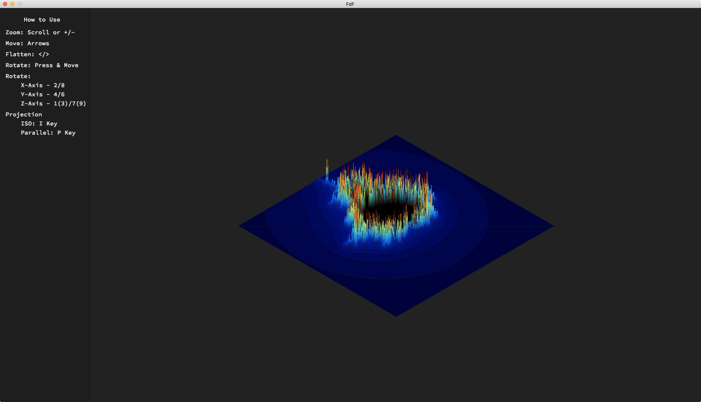
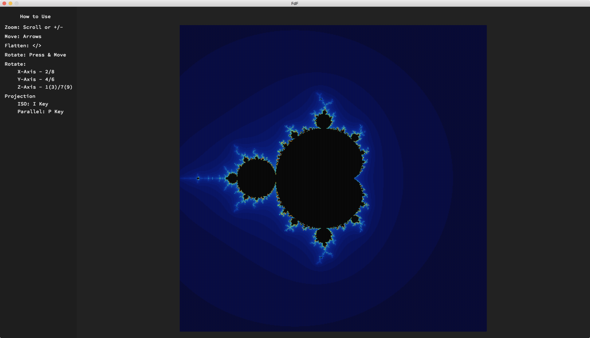
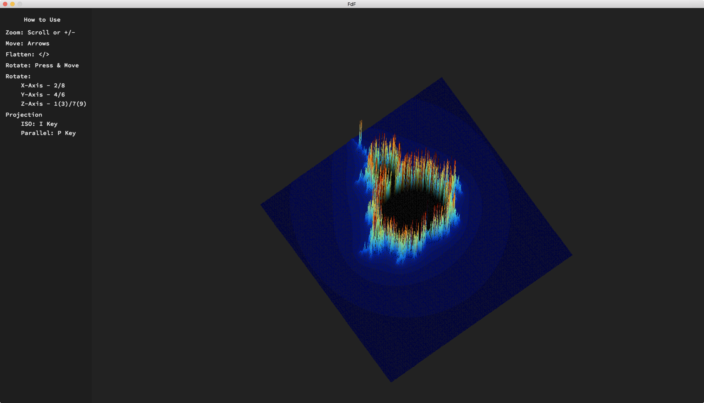
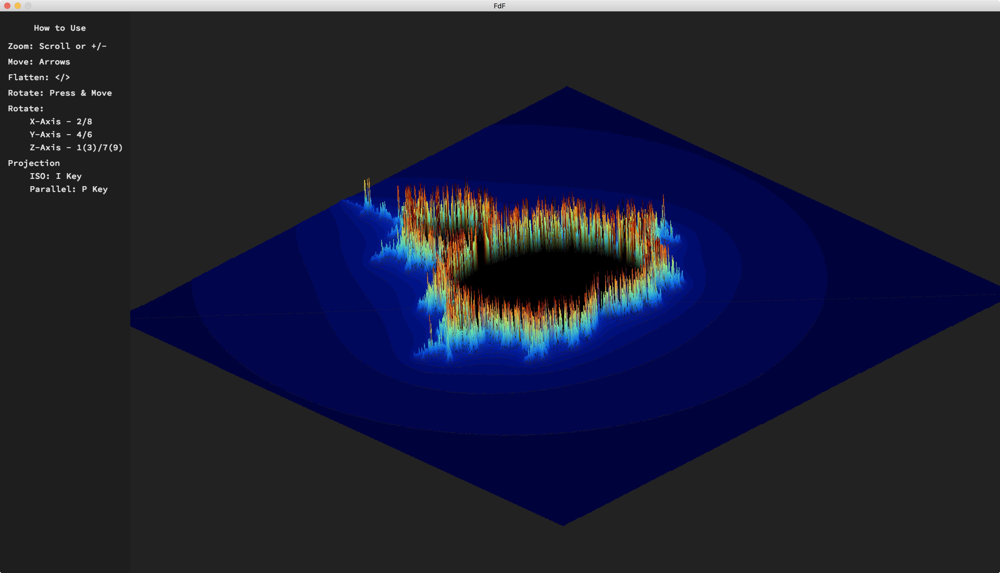
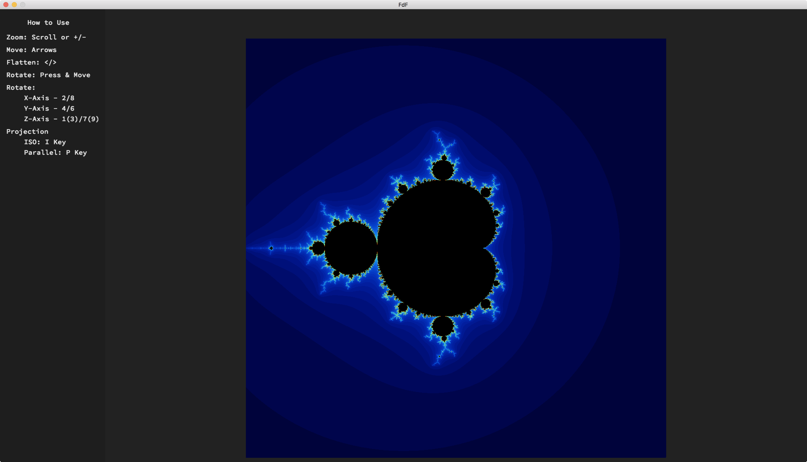
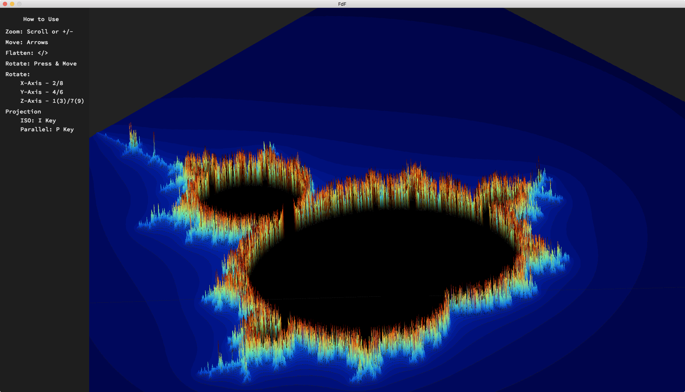
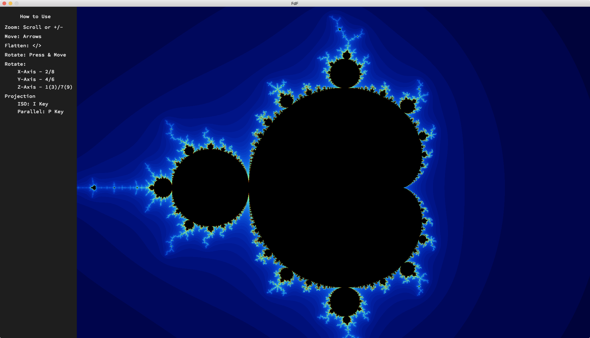
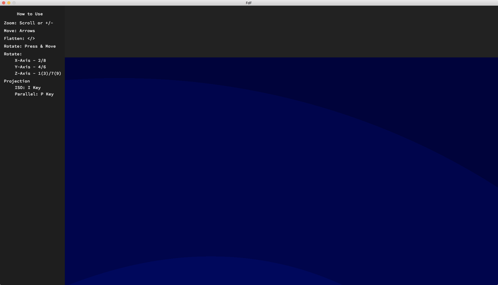

<title>Challenge your FdF</title>
<body>

    You think your FdF is good? 
    Try these tests to see how good you are! 
    I used FdF (github.com/VBrazhnik/FdF) for visualization because mine has readable buffer restrictions ( 

    The first test is a 500x500  Aka Julia card
    
    
    
    The second test is the 1000x1000 card, and it's not that easy.
    
    
    The third test is a 2000x2000 map if it works well
    
    
    The final test is a 5000x5000 map, a peak that few people will reach, but if you're running it, I'll take my hat off to you
    
    Translated with www.DeepL.com/Translator

</body>